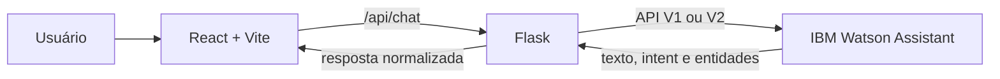

# FIAP - Faculdade de Informática e Administração Paulista

<p align="center">
  <a href="https://www.fiap.com.br/">
    
  </a>
</p>

<br>

# CardioIA Acolhe

## Grupo 7

## 👨‍🎓 Integrantes:

- <a href="https://github.com/Hinten/fiap_sprint4_reply/blob/master">Alice C. M. Assis — RM566233</a>
- <a href="https://github.com/Hinten/fiap_sprint4_reply/blob/master">Leonardo S. Souza — RM563928</a>
- <a href="https://github.com/Hinten/fiap_sprint4_reply/blob/master">Lucas B. Francelino — RM561409</a>
- <a href="https://github.com/Hinten/fiap_sprint4_reply/blob/master">Pedro L. T. Silva — RM561644</a>
- <a href="https://github.com/Hinten/fiap_sprint4_reply/blob/master">Vitor A. Bezerra — RM563001</a>

## 👩‍🏫 Professores:

### Tutor(a)

- <a href="https://github.com/Hinten/genera_genui#">Caique Nonato da Silva Bezerra</a>

### Coordenador(a)

- <a href="https://github.com/Hinten/genera_genui#">André Godoi Chiovato</a>

## 📜 Descrição

O **CardioIA Acolhe** é um assistente conversacional educativo para acolhimento inicial de pessoas que desejam organizar informações sobre sintomas cardiológicos antes de procurar atendimento profissional. A aplicação conduz um fluxo curto e determinístico: identifica o sintoma relatado, pergunta intensidade e duração, preserva essas respostas durante a conversa e apresenta um resumo estruturado. Também ajuda o usuário a preparar perguntas e informações para uma consulta.

A solução **não realiza diagnóstico, não prescreve tratamento e não substitui profissionais ou serviços de saúde**. Quando identifica sinais de alerta previstos no fluxo — como dor torácica intensa, falta de ar importante, suor frio ou desmaio — prioriza uma mensagem clara para busca imediata de emergência e orienta o contato com o SAMU pelo número 192. O projeto é acadêmico; não deve receber dados reais de pacientes.

O processamento de linguagem natural utiliza uma **Dialog Skill do IBM Watson Assistant**, com intents, entidades, sinônimos, variáveis de contexto, nó de emergência prioritário e fallback final. O backend Flask concentra as credenciais em variáveis de ambiente e oferece compatibilidade com a API V1 da Dialog Skill no plano Lite e com a API V2 quando um ambiente compatível estiver disponível. A interface oferece histórico, sugestões, indicadores de carregamento e erro, reinício da conversa, alerta de urgência e detalhes de NLP. Nenhum recurso de IA generativa é utilizado.

> **Aviso:** este é um protótipo educacional. Em caso de emergência, procure atendimento imediatamente ou ligue 192. Não insira nomes, documentos, prontuários ou outros dados pessoais.

## 🏗️ Arquitetura e fluxo



Prioridade do diálogo:

1. sinais explícitos de alerta;
2. coleta de sintoma, intensidade e duração;
3. resumo educativo e preparação para consulta;
4. limites, agradecimento e despedida;
5. fallback, sempre ao final.

## 🔌 API da aplicação

| Método | Rota | Finalidade |
|---|---|---|
| `GET` | `/api/health` | Informa saúde da aplicação e presença da configuração, sem expor segredos. |
| `POST` | `/api/chat` | Envia `message` e `conversationId`; devolve resposta, conversa, NLP e `urgent`. |
| `POST` | `/api/reset` | Encerra ou descarta a sessão e reinicia o contexto. |

Mensagens vazias ou maiores que 500 caracteres retornam `400`; configuração ausente retorna `503`; indisponibilidade do Watson retorna `502`. O modo V1 mantém somente o contexto efêmero necessário, com TTL de 30 minutos e limite de 500 conversas; não há persistência em banco. Uma sessão expirada é recriada uma única vez.

## 📁 Estrutura de pastas

Dentre os arquivos e pastas presentes na raiz do projeto, definem-se:

- <b>.github</b>: registros e arquivos de apoio à qualidade do repositório.
- <b>assets</b>: imagens e demais recursos visuais da documentação.
- <b>config/watson</b>: export versionado da Dialog Skill do Watson Assistant.
- <b>document</b>: fonte do relatório e roteiro da demonstração.
- <b>output/pdf</b>: relatório técnico final em PDF, pronto para entrega.
- <b>scripts</b>: rotinas auxiliares de validação e geração dos entregáveis.
- <b>src/backend</b>: API Flask e gateway para o Watson Assistant.
- <b>src/frontend</b>: interface React/Vite.
- <b>tests</b>: testes automatizados do backend e da estrutura do Watson.
- <b>.env.example</b>: nomes das variáveis necessárias, sem credenciais.
- <b>requirements.txt</b>: dependências Python.
- <b>README.md</b>: guia geral do projeto.

## ⚙️ Configuração do Watson Assistant

1. No IBM Cloud, use a instância existente no plano Lite e crie um assistant chamado **CardioIA Acolhe**.
2. Crie uma **Dialog Skill** em português brasileiro. Execute `python scripts/prepare_watson_upload.py` e importe o JSON compacto gerado em `tmp/watson/cardioia-dialog-upload.json`.
3. Vincule a skill ao novo assistant sem alterar os assistants já existentes.
4. Copie `.env.example` para `.env` e preencha localmente a URL e a API key. Na instância Classic/Lite, use `WATSON_API_MODE=v1` e informe `WATSON_WORKSPACE_ID`. Use `v2` somente se a própria instância fornecer `WATSON_ASSISTANT_ID` e `WATSON_ENVIRONMENT_ID` sem upgrade. **Nunca compartilhe nem versione a chave.**
5. Confirme no painel se as intents, entidades e a ordem dos nós foram importadas corretamente.

> A configuração do painel IBM deve ser realizada com o responsável pelo projeto acompanhando. Não confirme upgrade, plano pago ou complemento faturável.

## 🔧 Como executar o código

### Pré-requisitos

- Python 3.11 ou superior;
- Node.js 20 ou superior;
- pnpm 9 ou superior;
- instância IBM Watson Assistant Lite configurada.

### 1. Backend

```powershell
python -m venv .venv
.\.venv\Scripts\Activate.ps1
python -m pip install -r requirements.txt
Copy-Item .env.example .env
```

Para o plano Classic/Lite, preencha `WATSON_API_KEY`, `WATSON_URL`, `WATSON_API_MODE=v1` e `WATSON_WORKSPACE_ID`. Em uma instância V2 compatível, use `WATSON_API_MODE=v2` com os IDs de assistant e environment. O modo `auto` detecta a configuração completa disponível. Depois, inicie o Flask:

```powershell
python -m src.backend
```

### 2. Frontend em desenvolvimento

Em outro terminal:

```powershell
Set-Location src/frontend
pnpm install
pnpm dev
```

O Vite exibe a URL local e encaminha chamadas `/api` para o Flask.

### 3. Build integrado

```powershell
Set-Location src/frontend
pnpm build
Set-Location ../..
python -m src.backend
```

Depois do build, o Flask serve a interface e a API na mesma origem.

### 4. Testes e qualidade

```powershell
python -m pytest
pnpm --dir src/frontend lint
pnpm --dir src/frontend build
```

Resultado local verificado em 12/09/2026: **42 testes Python aprovados**, `pnpm lint` aprovado e build de produção Vite aprovado. O smoke test real deve ser repetido depois da configuração acompanhada no IBM Cloud.

Para o smoke test real, valide: conversa normal em três turnos, sinal de alerta direto, fallback, reinício de sessão e visualização mobile. Não use dados reais.

## 📄 Relatório técnico

- [Relatório CardioIA Acolhe — PDF](output/pdf/relatorio-cardioia.pdf)
- [Fonte textual do relatório](document/relatorio-cardioia.md)

## 🎥 Demonstração em vídeo

**PENDENTE**

## 🗃 Histórico de lançamentos

- 0.1.0 - 12/09/2026
  - Primeira versão do assistente, integração, interface, testes e documentação acadêmica.

## 📋 Licença

<p xmlns:cc="http://creativecommons.org/ns#" xmlns:dct="http://purl.org/dc/terms/"><a property="dct:title" rel="cc:attributionURL" href="https://github.com/Hinten/fiap2_fase5_cap1">CardioIA Acolhe</a> pelo <a rel="cc:attributionURL dct:creator" property="cc:attributionName" href="https://www.fiap.com.br/">Grupo 7 — FIAP</a> está licenciado sob <a href="https://creativecommons.org/licenses/by/4.0/deed.pt-br" target="_blank" rel="license noopener noreferrer" style="display:inline-block;">CC BY 4.0 Internacional</a>.</p>
