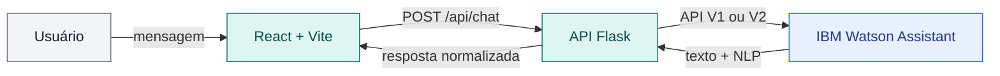

# FIAP — Faculdade de Informática e Administração Paulista

<p align="center">
  <a href="https://www.fiap.com.br/">
    
  </a>
</p>

<br>

<div align="center">
  
  <h1>CardioIA Acolhe</h1>
  <p><strong>Acolhimento educativo para organizar relatos de sintomas cardiológicos com segurança e clareza.</strong></p>
  <p>
    
    
  </p>
</div>

> [!IMPORTANT]
> O CardioIA Acolhe não realiza diagnóstico, não prescreve tratamento e não substitui profissionais ou serviços de saúde. Em caso de emergência, procure atendimento imediatamente ou ligue para o **SAMU 192**. Este projeto é acadêmico: não insira dados reais de pacientes.

## Grupo 7

## 👨‍🎓 Integrantes

| Integrante | RM |
|---|---:|
| Alice Caroline Marinho de Assis | 566233 |
| Leonardo Sampaio Souza | 563928 |
| Lucas Bassetto Francelino | 561409 |
| Pedro Lucas Tostes Silva | 561644 |
| Vitor Albuquerque Bezerra da Silva | 563001 |

## 👩‍🏫 Professores

### Tutor(a)

- Caique Nonato da Silva Bezerra

### Coordenador(a)

- André Godoi Chiovato

## Sumário

- [Descrição](#descricao)
- [Demonstração da interface](#interface)
- [Aderência ao enunciado](#aderencia)
- [Como funciona](#como-funciona)
- [Arquitetura](#arquitetura)
- [API da aplicação](#api)
- [Estrutura de pastas](#estrutura)
- [Configuração do Watson Assistant](#configuracao)
- [Como executar o código](#execucao)
- [Testes e qualidade](#qualidade)
- [Histórico de lançamentos](#historico)
- [Licença](#licenca)

<a id="descricao"></a>

## 📜 Descrição

O **CardioIA Acolhe** é um assistente conversacional educativo que ajuda uma pessoa a organizar informações sobre sintomas cardiológicos antes de procurar atendimento profissional. Em uma conversa curta e determinística, a aplicação identifica o sintoma relatado, pergunta intensidade e duração, preserva as respostas no contexto e devolve um resumo estruturado. Também ajuda o usuário a preparar perguntas e informações para uma consulta.

O processamento de linguagem natural utiliza uma **Dialog Skill do IBM Watson Assistant**, sem IA generativa. A skill em português brasileiro reúne intents, entidades, sinônimos, variáveis de contexto, um nó de emergência prioritário e fallback final. O backend Flask protege as credenciais e normaliza as respostas; a interface web baseada em HTML, React e Vite oferece histórico, sugestões, estados de carregamento e erro, reinício da conversa, alerta de urgência e detalhes de NLP.

<a id="interface"></a>

## 🖼️ Demonstração da interface

<p align="center">
  
  <br>
  <sub>Interface desktop conectada — 1440 × 900 px</sub>
</p>

<p align="center">
  
  <br>
  <sub>Interface responsiva conectada — 390 × 844 px</sub>
</p>

> [!NOTE]
> As capturas registram o estado inicial real com **Serviço disponível**. Para não expor dados pessoais nem transformar uma conversa clínica em conteúdo público, as imagens não contêm mensagens de teste; os cenários verificados no smoke test estão descritos na seção [Testes e qualidade](#qualidade).

<a id="aderencia"></a>

## 🎯 Aderência ao enunciado

| Critério ou entregável | Evidência | Situação atual |
|---|---|---|
| Fluxo conversacional com NLP — 3 pontos | 7 intents, 4 entidades, 14 nós, contexto, fallback e alerta prioritário | **Implementado e verificado** |
| Integração entre backend e assistente — 2 pontos | Flask integrado ao IBM Watson Assistant Classic/Lite pela API V1 | **Verificada em 13/09/2026** |
| Interface funcional — 2 pontos | Aplicação web React/Vite baseada em HTML, integrada à API e registrada nas capturas acima | **Implementada e verificada** |
| Organização e clareza do código — 2 pontos | Estrutura por frontend, backend, configuração, scripts e testes | **Disponível** |
| Documentação — 1 ponto | README, relatório técnico de duas páginas e instruções de reprodução | **Disponível** |
| Backend Python | [`src/backend`](src/backend) | **Disponível** |
| Export do assistente | [`cardioia-dialog.json`](config/watson/cardioia-dialog.json) | **Disponível** |
| Relatório curto | [PDF](output/pdf/relatorio-cardioia.pdf) · [fonte em Markdown](document/relatorio-cardioia.md) | **Disponível — 2 páginas** |
| Repositório GitHub público | Repositório do projeto | **Exceção consciente:** mantido privado; deve ser publicado antes da entrega |
| Vídeo de até 3 minutos | [Roteiro da demonstração](document/roteiro-video.md) | **Pendente de gravação e publicação** |
| Grupo de 4 a 5 integrantes — 1 ponto extra | Grupo 7 com cinco integrantes identificados acima | **Atende à formação recomendada** |

> [!WARNING]
> Para atender integralmente ao enunciado antes da entrega, ainda é necessário publicar o vídeo e tornar o repositório acessível ao avaliador. O PDF preserva um registro anterior de 33 testes; a execução atual, documentada abaixo, possui 42 testes aprovados. Os desafios opcionais “Ir Além” não fazem parte do escopo desta versão.

<a id="como-funciona"></a>

## 💬 Como funciona

| Etapa | O que acontece |
|---:|---|
| **1. Relato** | O usuário descreve um sintoma em linguagem natural. |
| **2. Coleta** | O diálogo solicita intensidade e duração e mantém essas informações no contexto. |
| **3. Orientação** | O assistente apresenta um resumo educativo e ajuda a preparar a consulta. |

Sinais explícitos de alerta têm prioridade sobre o fluxo comum. Dor torácica intensa, falta de ar importante, suor frio ou desmaio acionam uma orientação clara para busca imediata de emergência ou contato com o SAMU 192 — sem inferir causa ou diagnóstico.

A ordem do diálogo é:

1. sinais explícitos de alerta;
2. coleta de sintoma, intensidade e duração;
3. resumo educativo e preparação para consulta;
4. limites, agradecimento e despedida;
5. fallback, sempre ao final.

<a id="arquitetura"></a>

## 🏗️ Arquitetura



O frontend nunca acessa o Watson diretamente. O backend atua como fronteira de segurança, lê credenciais somente de variáveis de ambiente e oferece compatibilidade com a API V1 da Dialog Skill em instâncias Classic/Lite e com a API V2 quando um ambiente compatível estiver disponível.

Na V1, o contexto é efêmero e mantido apenas na memória do processo por até 30 minutos, com limite de 500 conversas. Não há banco de dados nem persistência de conversas. As requisições ao Watson incluem opt-out de aprendizagem; ainda assim, a demonstração deve usar somente frases fictícias, sem nomes, documentos, prontuários ou outros dados pessoais.

<a id="api"></a>

## 🔌 API da aplicação

| Método | Rota | Finalidade |
|---|---|---|
| `GET` | `/api/health` | Informa a saúde da aplicação e a presença da configuração, sem expor segredos. |
| `POST` | `/api/chat` | Envia `message` e `conversationId`; devolve resposta, conversa, NLP e `urgent`. |
| `POST` | `/api/reset` | Encerra ou descarta a sessão e reinicia o contexto. |

Mensagens vazias ou maiores que 500 caracteres retornam `400`; configuração ausente retorna `503`; indisponibilidade do Watson retorna `502`. Uma sessão V2 expirada é recriada uma única vez.

<details>
<summary><strong>Exemplo do contrato de chat</strong></summary>

Requisição:

```json
{
  "message": "Estou sentindo palpitação",
  "conversationId": null
}
```

Resposta normalizada:

```json
{
  "reply": "Qual é a intensidade de 0 a 10?",
  "conversationId": "identificador-da-conversa",
  "intent": "relatar_sintoma",
  "confidence": 0.92,
  "entities": [
    {
      "entity": "sintoma",
      "value": "palpitacao",
      "confidence": 0.95
    }
  ],
  "urgent": false
}
```

Os textos e níveis de confiança variam conforme a resposta do Watson; o exemplo apenas ilustra o formato da API.

</details>

<a id="estrutura"></a>

## 📁 Estrutura de pastas

Dentre os arquivos e pastas presentes na raiz do projeto, definem-se:

```text
.
├── .github/                  # arquivos de apoio à qualidade do repositório
├── assets/                   # marca e capturas de tela da documentação
├── config/watson/            # export versionado da Dialog Skill
├── document/                 # relatório técnico e roteiro da demonstração
├── output/pdf/               # relatório técnico final em PDF
├── scripts/                  # validação, preparação e geração de entregáveis
├── src/
│   ├── backend/              # API Flask e gateway do Watson Assistant
│   └── frontend/             # interface React/Vite
├── tests/backend/            # testes da API, gateway e export do Watson
├── .env.example              # modelo de configuração, sem credenciais
├── requirements.txt          # dependências Python
└── README.md                 # guia geral do projeto
```

<a id="configuracao"></a>

## ⚙️ Configuração do Watson Assistant

1. No IBM Cloud, use uma instância existente no plano Lite e crie um assistant chamado **CardioIA Acolhe**.
2. Crie uma **Dialog Skill** em português brasileiro.
3. Execute `python scripts/prepare_watson_upload.py` e importe o arquivo compacto gerado em `tmp/watson/cardioia-dialog-upload.json`.
4. Vincule a skill ao novo assistant sem alterar os assistentes já existentes.
5. Copie `.env.example` para `.env` e escolha o modo compatível com a instância:

| Modo | Variáveis obrigatórias |
|---|---|
| `v1` — Dialog Skill Classic/Lite | `WATSON_API_KEY`, `WATSON_URL`, `WATSON_WORKSPACE_ID` |
| `v2` — assistant + environment | `WATSON_API_KEY`, `WATSON_URL`, `WATSON_ASSISTANT_ID`, `WATSON_ENVIRONMENT_ID` |
| `auto` | Seleciona a configuração V2 completa; caso contrário, usa V1 se houver `WATSON_WORKSPACE_ID` |

6. Confirme no painel se as intents, entidades e a ordem dos nós foram importadas corretamente.

> [!CAUTION]
> Nunca compartilhe nem versione a API key. A configuração do IBM Cloud deve ser realizada com o responsável pelo projeto acompanhando. Não confirme upgrade, plano pago ou complemento faturável.

<a id="execucao"></a>

## 🔧 Como executar o código

### Pré-requisitos

- Git;
- Python 3.11 ou superior;
- Node.js 20.19+ ou 22.12+;
- pnpm 11.19 ou compatível;
- instância IBM Watson Assistant configurada para conversas reais.

Os comandos abaixo usam **PowerShell**.

### 1. Obtenha o projeto

```powershell
git clone https://github.com/Hinten/fiap2_fase5_cap1.git
Set-Location fiap2_fase5_cap1
```

### 2. Prepare o backend

```powershell
python -m venv .venv
.\.venv\Scripts\Activate.ps1
python -m pip install -r requirements.txt
Copy-Item .env.example .env
```

Preencha o `.env` de acordo com o modo V1 ou V2 descrito acima. Em seguida, inicie a API:

```powershell
python -m src.backend
```

O backend fica disponível em `http://127.0.0.1:5000`. Como alternativa, após criar a `.venv`, execute `./scripts/run-dev.ps1` para iniciar o Flask em modo de desenvolvimento.

### 3. Inicie o frontend

Em outro terminal, na raiz do projeto:

```powershell
pnpm --dir src/frontend install --frozen-lockfile
pnpm --dir src/frontend dev
```

A interface fica disponível em `http://127.0.0.1:5173` e encaminha as chamadas `/api` para o Flask.

### 4. Gere o build integrado

```powershell
pnpm --dir src/frontend build
python -m src.backend
```

Após o build, o Flask serve a interface e a API na mesma origem em `http://127.0.0.1:5000`.

<a id="qualidade"></a>

## ✅ Testes e qualidade

Na raiz do projeto, com o ambiente Python ativo e as dependências do frontend instaladas:

```powershell
python -m pytest
pnpm --dir src/frontend lint
pnpm --dir src/frontend build
```

Resultado local verificado em 13/09/2026: **42 testes aprovados com Python 3.14.0**, lint aprovado com ESLint 10.10.0 e build de produção aprovado com Vite 8.3.0. A suíte cobre o contrato da API, validações, contexto e sessões, normalização das respostas e estrutura da Dialog Skill.

O smoke test real foi concluído em 13/09/2026 com uma instância IBM Watson Assistant Classic/Lite, Dialog Skill **CardioIA Acolhe** e API V1. Foram verificados pela API Flask e pela interface React:

- fluxo normal em três turnos, preservando sintoma, intensidade e duração no contexto;
- reconhecimento de intensidade numérica com `@sys-number` e geração do resumo;
- sinal de alerta direto, retornando `urgent: true` e orientação de emergência;
- fallback para pergunta fora do escopo;
- reinício da sessão;
- visualização responsiva em viewport mobile.

Todos os cenários empregaram exclusivamente frases fictícias, sem dados pessoais.

<a id="historico"></a>

## 🗃 Histórico de lançamentos

- **0.1.0 — 12/09/2026**
  - Primeira versão do assistente, da interface, dos testes automatizados e da documentação acadêmica.
  - Integração real com o IBM Watson Assistant V1 verificada em 13/09/2026.
  - Vídeo de demonstração mantido como pendência explícita.

<a id="licenca"></a>

## 📋 Licença

<p>
  
  
</p>

O **CardioIA Acolhe**, do Grupo 7 — FIAP, está licenciado sob a [Creative Commons Atribuição 4.0 Internacional](https://creativecommons.org/licenses/by/4.0/deed.pt-br) (**CC BY 4.0**).

---

<p align="center"><sub>Projeto acadêmico · FIAP · Fase 5, Capítulo 1</sub></p>
